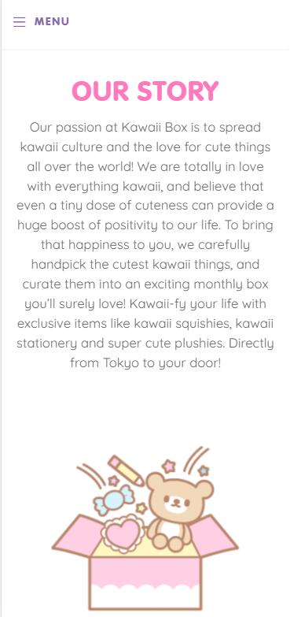

# Procesverslag
Markdown is een simpele manier om HTML te schrijven.  
Markdown cheat cheet: [Hulp bij het schrijven van Markdown](https://github.com/adam-p/markdown-here/wiki/Markdown-Cheatsheet).

Nb. De standaardstructuur en de spartaanse opmaak van de README.md zijn helemaal prima. Het gaat om de inhoud van je procesverslag. Besteedt de tijd voor pracht en praal aan je website.

Nb. Door *open* toe te voegen aan een *details* element kun je deze standaard open zetten. Fijn om dat steeds voor de relevante stuk(ken) te doen.

## Jij

uitwerken voor kick-off werkgroep

### Auteur:
Demi Broere

#### Je startniveau:
Rood

#### Je focus:
Surface
 

## Je website

uitwerken voor kick-off werkgroep

### Je opdracht: 
 https://www.kawaiibox.com/
 
#### Screenshot(s) van de eerste pagina (small screen): 
hier de naam van de pagina  

#### Screenshot(s) van de tweede pagina (small screen):
hier de naam van de pagina  
 
 

## Breakdownschets (week 1)

uitwerken na afloop 2e werkgroep

### de hele pagina: 

### dynamisch deel (bijv menu): 

## Voortgang 1 (week 2)

uitwerken voor 1e voortgang

### Stand van zaken
Ik ben deze week druk bezig geweest met het opzetten van de html en langzaam aan begonnen met het toevoegen van de CSS. Het was erg lastig om er mee te beginnen, omdat het alweer een tijdje geleden was dat ik code heb aangeraakt. Ik vond het dan in het begin ook wel erg overweldigend, maar eenmaal bezig ging het eigenlijk wel goed. Dat we nu weer tijd hebben om in het klaslokaal aan de slag te gaan heeft mij erg goed geholpen, omdat ik het makkelijker vind om hulp te vragen in de klas dan via online. 
 
Er was een ding waar ik een beetje tegenaan liep en dat was het onderstaande. In de officiële website is dit een slider met buttons, maar ik heb er een slider van gemaakt met scroll. Ik hoop een carousel nog toe te voegen bij een ander deel van de website, zodat ik die er toch in verwerkt heb. 
 

### Verslag van meeting
 
De meeting ging eigenlijk prima, ik vond het wel fijn om weer even bezig te zijn. Ik had niet veel vragen, omdat ik nog niet heel ver was. De enige vraag die ik had was of het nodig was om elke keer de code te moeten herhalen, maar dat was (gelukkig) niet het geval. Anders had ik dat nog moeten aanpassen. De studentassistenten hadden mij een goede tip gegeven om aan de slag te gaan met de carousel. 

## Voortgang 2 (week 3)

uitwerken voor 2e voortgang

### Stand van zaken
hier dit ging goed & dit was lastig (neem ook screenshots op van delen van je website en code)

### Agenda voor meeting
samen met je groepje opstellen

| student 1      | student 2          | student 3    | student 4        |
| ---            | ---                | ---          | ---              |
| dit bespreken  | en dit             | en ik dit    | en dan ik dat    |
| en dat ook nog | dit als er tijd is | nog een punt | dit wil ik zeker |
| ...            | ...                | ...          | ...              |

### Verslag van meeting
hier na afloop snel de uitkomsten van de meeting vastleggen

- punt 1
- punt 2
- nog een punt
- ...

## Toegankelijkheidstest (week 4)

uitwerken na test in 8e voortgang

### Bevindingen
Lijst met je bevindingen die in de test naar voren kwamen:

#### Titel eerste bevinding
Hier korte omschrijving (met indien nodig een afbeelding)

Hier een omschrijving van hoe het opgelost kan worden (met indien nodig een afbeelding)

#### Titel tweede bevinding. 
Hier korte omschrijving (met indien nodig een afbeelding)

Hier een omschrijving van hoe het opgelost kan worden (met indien nodig een afbeelding)

#### Titel volgende bevinding. 
Hier korte omschrijving (met indien nodig een afbeelding)

Hier een omschrijving van hoe het opgelost kan worden (met indien nodig een afbeelding)

#### Titel nog een bevinding. 
Hier korte omschrijving (met indien nodig een afbeelding)

Hier een omschrijving van hoe het opgelost kan worden (met indien nodig een afbeelding)

## Voortgang 3 (week 4)

uitwerken voor 3e voortgang

### Stand van zaken
hier dit ging goed & dit was lastig (neem ook screenshots op van delen van je website en code)

### Agenda voor meeting
samen met je groepje opstellen

| student 1      | student 2          | student 3    | student 4        |
| ---            | ---                | ---          | ---              |
| dit bespreken  | en dit             | en ik dit    | en dan ik dat    |
| en dat ook nog | dit als er tijd is | nog een punt | dit wil ik zeker |
| ...            | ...                | ...          | ...              |

### Verslag van meeting
hier na afloop snel de uitkomsten van de meeting vastleggen

- punt 1
- punt 2
- nog een punt
- ...

## Eindgesprek (week 5)

uitwerken voor eindgesprek

### Stand van zaken
hier dit ging goed & dit was lastig (neem ook screenshots op van delen van je website en code)

### Screenshot(s)

hier screenshot(s) van je eindresultaat

## Bronnenlijst

continu bijhouden terwijl je werkt

Nb. Wees specifiek ('css-tricks' als bron is bijv. niet specifiek genoeg).

1. bron 1
2. bron 2
3. ...

