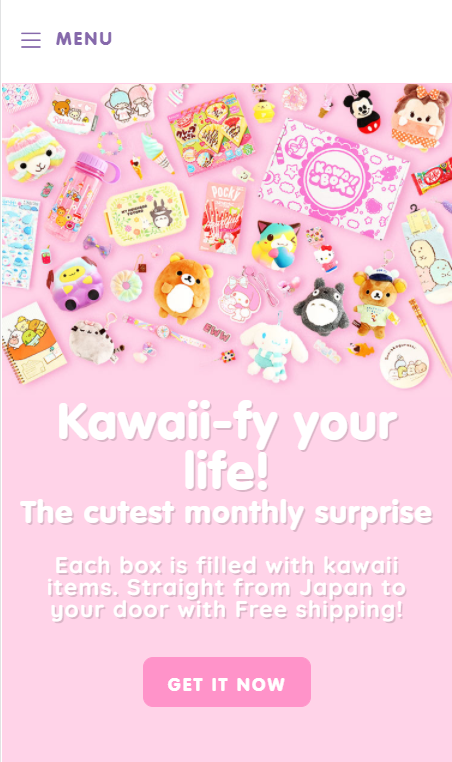

# Procesverslag
Markdown is een simpele manier om HTML te schrijven.  
Markdown cheat cheet: [Hulp bij het schrijven van Markdown](https://github.com/adam-p/markdown-here/wiki/Markdown-Cheatsheet).

Nb. De standaardstructuur en de spartaanse opmaak van de README.md zijn helemaal prima. Het gaat om de inhoud van je procesverslag. Besteedt de tijd voor pracht en praal aan je website.

Nb. Door *open* toe te voegen aan een *details* element kun je deze standaard open zetten. Fijn om dat steeds voor de relevante stuk(ken) te doen.

## Jij

uitwerken voor kick-off werkgroep

### Auteur:
Demi Broere

#### Je startniveau:
Rood

#### Je focus:
Surface
 

## Je website

uitwerken voor kick-off werkgroep

### Je opdracht: 
 https://www.kawaiibox.com/
 
#### Screenshot(s) van de eerste pagina (small screen): 
Hoofdpagina  

#### Screenshot(s) van de tweede pagina (small screen):
About
  
 

## Breakdownschets (week 1)

uitwerken na afloop 2e werkgroep

### de hele pagina: 

### dynamisch deel (bijv menu): 

## Voortgang 1 (week 2)

uitwerken voor 1e voortgang

### Stand van zaken
Ik ben deze week druk bezig geweest met het opzetten van de html en langzaam aan begonnen met het toevoegen van de CSS. Het was erg lastig om er mee te beginnen, omdat het alweer een tijdje geleden was dat ik code heb aangeraakt. Ik vond het dan in het begin ook wel erg overweldigend, maar eenmaal bezig ging het eigenlijk wel goed. Dat we nu weer tijd hebben om in het klaslokaal aan de slag te gaan heeft mij erg goed geholpen, omdat ik het makkelijker vind om hulp te vragen in de klas dan via online. 
 
Er was een ding waar ik een beetje tegenaan liep en dat was het onderstaande. In de officiële website is dit een slider met buttons, maar ik heb er een slider van gemaakt met scroll. Ik hoop een carousel nog toe te voegen bij een ander deel van de website, zodat ik die er toch in verwerkt heb. 
 
 
 
### Agenda voor meeting
samen met je groepje opstellen

Teamgenoten communiceren niet. 

### Verslag van meeting
 
De meeting ging eigenlijk prima, ik vond het wel fijn om weer even bezig te zijn. Ik had niet veel vragen, omdat ik nog niet heel ver was. De enige vraag die ik had was of het nodig was om elke keer de code te moeten herhalen, maar dat was (gelukkig) niet het geval. Anders had ik dat nog moeten aanpassen. De studentassistenten hadden mij een goede tip gegeven om aan de slag te gaan met de carousel. 

## Voortgang 2 (week 3)

uitwerken voor 2e voortgang

### Stand van zaken
 Ik sta er redelijk goed voor, ik ben goed bezig geweest met de eerste pagina en als deze af is kan ik makkelijker door naar de tweede pagina, omdat dan alles al goed staat. Wat ik erg lastig vind om te doen is de carousel, maar daar heb ik ook nog niet echt naar gekeken. Hier en daar heb ik geprobeerd verschillende delen al wat responsive te maken, omdat ik dat leuk vond om te doen en omdat ik het af en toe vervelend vind om maar met één ding bezig te zijn ( in dit geval de surface plane ). Al met al vind ik dat ik goed op weg ben.
 
Eindelijk had ik de form goed gekregen. 
 

### Agenda voor meeting
samen met je groepje opstellen

Teamgenoten communiceren niet. 

### Verslag van meeting

 In de meeting was naar voren gekomen dat niet precies alles hetzelfde moest en dat je ook dingen anders mag doen. Dit gaf me wel wat meer rust. Ik moest nog wat focussen op de buttons en de margins rondom de footer. Dit heb ik dan ook aangepast.

## Toegankelijkheidstest (week 4)

uitwerken na test in 8e voortgang

### Bevindingen
Lijst met je bevindingen die in de test naar voren kwamen:

1.	States toevoegen ( focus, hover, disabled, active, visited ) 
2.	Hamburger menu verduidelijken, krijg button
3.	Blockquote verduidelijken
4.	Geef body een ID en maak van sections weer :first-of
5.	Buttons vergroten voor mobiel 
6.	Linkjes vergroten van de footer
7.	About mobile tekst breder maken 
8.	Social media buttons aanpassen, want de naam doet het niet op screenreader
9.	Label boven input

#### States toevoegen, met name focus.
De focus valt niet op. 
 
De kleuren van de focus aanpassen en eventueel een border, zodat de aandacht van de gebruiker wordt getrokken.

#### Mobiel menu
De menubutton op mobiel wordt weergegeven als button door de screenreader. 

Een alt toevoegen aan de button. 

#### Blockquote verduidelijken.
Het was niet echt duidelijk dat het ging om een quote. 

Hier een omschrijving van hoe het opgelost kan worden (met indien nodig een afbeelding)

#### Footer links
De linkjes van de footer waren zo klein dat ze moeilijk te lezen waren. 

De tekst iets groter maken, zodat het niet zo wegvalt en gebruikers het alsnog kunnen lezen. 

#### Label boven input email
Het was voor de screenreader niet duidelijk, ook is het voor mensen die het moeilijk vinden om zich te concentreren misschien moeilijk te onthouden dat het bij deze gaat om een e-mail. 

Een label toevoegen met 'e-mail'. 

#### Social media buttons aanpassen, want de naam doet het niet op screenreader

De social media buttons werden door de screenreader helemaal niet opgelezen, waardoor ze niet zouden snappen waar het over ging. 

Alts toevoegen?

#### About mobile tekst breder maken 

Op de mobiele pagina was de about tekst heel erg smal. 

De width aanpassen, zodat het de hele breedte in beslag neemt. 

#### Buttons vergroten voor mobiel 
De buttons op mobiel vielen niet erg op en waren moeilijk aan te klikken voor mensen met een beperking zoals parkinson, waarbij je hele arm trilt en je weinig controle hebt. 

## Voortgang 3 (week 4)

uitwerken voor 3e voortgang

### Stand van zaken
Ook deze week verliep eigenlijk alles weer soepel, ik wist wat me te doen stond en waar ik nog aan moest werken om mijn eindproduct te kunnen opleveren. Ik vond de carousel erg lastig om te doen. 

### Agenda voor meeting
samen met je groepje opstellen

We bespraken niet echt dingen met het groepje, we gingen vaak gewoon over de algemene dingen per persoon en bespraken daar waar we tegen aan liepen. 

### Verslag van meeting
hier na afloop snel de uitkomsten van de meeting vastleggen

- punt 1
- punt 2
- nog een punt
- ...

## Eindgesprek (week 5)

uitwerken voor eindgesprek

### Stand van zaken
hier dit ging goed & dit was lastig (neem ook screenshots op van delen van je website en code)

### Screenshot(s)

hier screenshot(s) van je eindresultaat

## Bronnenlijst

continu bijhouden terwijl je werkt

Nb. Wees specifiek ('css-tricks' als bron is bijv. niet specifiek genoeg).

1. bron 1
2. bron 2
3. ...

